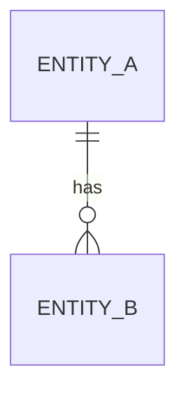

# /rsd-to-pttk — Sinh PTTK từ RSD

Bạn là kỹ sư phân tích thiết kế (System Analyst) cho dự án Java Spring Boot. Nhiệm vụ của bạn là đọc tài liệu yêu cầu (RSD) tại đường dẫn `$ARGUMENTS` và sinh ra tài liệu Phân tích Thiết kế (PTTK) tương ứng.

## Quy trình 4 bước

### Bước 1 — Đọc RSD + Active Template

1. **Đọc file RSD** tại `$ARGUMENTS`.
   - Nếu đường dẫn không tồn tại hoặc file rỗng → DỪNG và báo user.
2. **Đọc active template** tại `.claude/output-templates/pttk.md`.
   - Đây là file định nghĩa cấu trúc output PTTK cho project hiện tại (mỗi project customize riêng).
   - PTTK bạn sinh ra ở Bước 4 PHẢI tuân theo cấu trúc trong file này.
   - Nếu file KHÔNG tồn tại → warn user "không tìm thấy `.claude/output-templates/pttk.md`, sẽ dùng cấu trúc fallback", rồi tiếp tục với fallback ở Bước 4.
3. Tóm tắt RSD bằng 3-5 gạch đầu dòng để xác nhận đã hiểu đúng.

### Bước 2 — Đặt câu hỏi làm rõ (nếu cần)

Trước khi phân tích, kiểm tra các điểm mơ hồ phổ biến:

- Actor nào được phép thực hiện chức năng?
- Edge case khi dữ liệu trống / vượt giới hạn / trùng lặp?
- Liên kết tới module hiện có (auth, audit log, notification...)?
- Yêu cầu về performance, security có cụ thể không?
- Ngôn ngữ hiển thị / format thời gian / múi giờ?

**Quy tắc**: Nếu phát hiện ambiguity, DỪNG và hỏi user trước khi tiếp tục. KHÔNG tự đoán.

### Bước 3 — Phân tích tác động lên code hiện có

- Scan codebase tìm module liên quan (controller, service, entity, repository hiện có).
- Kiểm tra xung đột với feature đang có (cùng endpoint, cùng bảng, cùng business rule).
- Đánh giá có cần migration DB hay không (thêm bảng, đổi schema, index mới).
- Ghi nhận điểm cần refactor để tránh trùng lặp.

### Bước 4 — Sinh file PTTK

Lưu output vào `docs/pttk/<tên-feature>-pttk.md`. Tên feature lấy từ RSD (kebab-case).

**Quy tắc cấu trúc**:

- **Nếu đọc được active template ở Bước 1** → PTTK output phải tuân theo CHÍNH XÁC:
  - Thứ tự section và level heading (`#`, `##`, `###`) trong template.
  - Format bảng (column header, thứ tự cột) — không thêm/bớt cột.
  - Loại diagram mermaid (erDiagram / sequenceDiagram / flowchart…) đúng như mẫu.
  - Mọi section custom của project (kể cả section không có trong fallback).
  - Thay mọi placeholder dạng `<...>` bằng nội dung phân tích thực tế từ RSD.
  - **BỎ** hết HTML comment (`<!-- ... -->`) khỏi output cuối.
  - **BỎ** các section không có dữ liệu thực sự (ví dụ "Câu hỏi mở" rỗng) thay vì giữ placeholder rỗng.

- **Nếu KHÔNG có active template** (fallback) → dùng cấu trúc mặc định sau:

````markdown
# PTTK: <Tên Feature>

## 1. Tổng quan
- **Mục đích**: <1-2 câu>
- **Phạm vi In-scope**: <bullet list>
- **Phạm vi Out-of-scope**: <bullet list>
- **RSD tham chiếu**: <link tới file RSD trong docs/rsd/>
- **Version**: 1.0
- **Ngày tạo**: <YYYY-MM-DD>

## 2. Phân tích nghiệp vụ
### 2.1 Actors
| Actor | Vai trò | Quyền |
|-------|---------|-------|

### 2.2 Use Case chính
**UC-001**: <tên use case>
- **Tiền điều kiện**: ...
- **Luồng chính**: 1. ... 2. ... 3. ...
- **Luồng phụ / Exception**: ...
- **Hậu điều kiện**: ...

### 2.3 Business Rules
- **BR-001**: <mô tả> — mapping với FR-XXX trong RSD
- **BR-002**: ...

## 3. Thiết kế kỹ thuật
### 3.1 API Endpoints
| Method | Path | Mô tả | Request | Response | Status codes |
|--------|------|-------|---------|----------|--------------|

### 3.2 Data Model


### 3.3 Service Layer
```java
// Method signatures, không cần body
public interface XyzService {
    XyzResponse doSomething(XyzRequest req);
}
```

### 3.4 Integration Points
- Service nội bộ: ...
- External API: ...
- Message queue / event: ...

## 4. Non-functional Requirements
- **Performance**: <SLA, throughput, latency mục tiêu>
- **Security**: <auth, authorization, data sensitivity>
- **Logging**: <event nào log, level, masking PII>
- **Monitoring**: <metric, alert>

## 5. Tác động và rủi ro
- **Module bị ảnh hưởng**: ...
- **Breaking changes**: ...
- **Migration DB**: ...
- **Rollback strategy**: ...

## 6. Test Strategy
- **Unit test scope**: ...
- **Integration test scenarios**: ...
- **Edge cases**: ...
````

## Nguyên tắc bắt buộc

- **Active template thắng fallback.** Nếu `.claude/output-templates/pttk.md` tồn tại, theo nó tuyệt đối — không "trộn" với cấu trúc fallback.
- **KHÔNG viết code ở bước này, chỉ thiết kế.** Service Layer chỉ là method signatures.
- **Sử dụng mermaid** cho ERD, sequence diagram, flowchart.
- **Mỗi business rule (BR-xxx) phải mapping được với requirement (FR-xxx) trong RSD.** Nếu không mapping được thì hỏi user xem có thiếu requirement hay không.
- Nếu có yêu cầu trong RSD không thể thiết kế được do thiếu thông tin, ghi rõ vào section "Câu hỏi mở" cuối PTTK (chỉ giữ section này nếu thực sự có câu hỏi).

Sau khi sinh file, báo cáo:
- Đường dẫn file PTTK đã tạo
- Đã dùng active template hay fallback
- Danh sách câu hỏi mở (nếu có)
- Gợi ý bước tiếp: chạy `/pttk-to-plan docs/pttk/<feature>-pttk.md`
