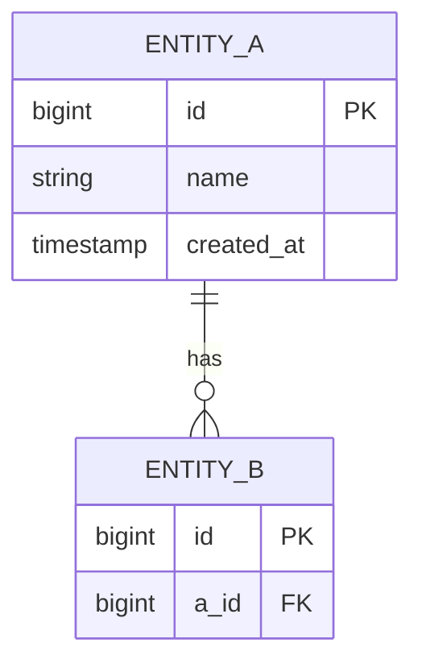

<!--
=========================================================================
ACTIVE TEMPLATE — đọc bởi slash command /rsd-to-pttk
=========================================================================
File này định nghĩa cấu trúc output PTTK cho **dự án này**. Khi chạy
/rsd-to-pttk, Claude sẽ đọc file này và sinh PTTK theo CHÍNH XÁC cấu
trúc, thứ tự section, format bảng, kiểu mermaid... ở đây.

Mỗi project nên customize file này cho khớp convention nội bộ:
- Thêm / bớt section (ví dụ: thêm "Threat Model" nếu team làm fintech)
- Đổi format bảng API (ví dụ: thêm cột "Rate limit", "Auth required")
- Đổi loại mermaid diagram mặc định
- Thêm section bắt buộc cho domain riêng (compliance, audit, i18n...)

Quy ước:
- Mọi thứ trong `<...>` là placeholder Claude sẽ điền dựa trên RSD.
- Comment `<!-- ... -->` như khối này sẽ bị BỎ khi sinh file PTTK.
- Giữ nguyên thứ tự heading + level (#, ##, ###) để command parse đúng.
=========================================================================
-->

# PTTK: <Tên Feature>

## 1. Tổng quan

- **Mục đích**: <1-2 câu mô tả mục tiêu nghiệp vụ của feature>
- **Phạm vi In-scope**:
  - <Tính năng 1>
  - <Tính năng 2>
- **Phạm vi Out-of-scope**:
  - <Không làm 1>
- **RSD tham chiếu**: [docs/rsd/<feature>-rsd.md](../rsd/<feature>-rsd.md)
- **Version**: 1.0
- **Ngày tạo**: <YYYY-MM-DD>

## 2. Phân tích nghiệp vụ

### 2.1 Actors

| Actor | Vai trò | Quyền |
|-------|---------|-------|
| <Actor 1> | <Mô tả> | <Permission codes> |

### 2.2 Use Case chính

**UC-001**: <Tên use case>

- **Tiền điều kiện**: <bullet list>
- **Luồng chính**:
  1. <Step 1>
  2. <Step 2>
- **Luồng phụ / Exception**:
  - <Khi A xảy ra → xử lý B>
- **Hậu điều kiện**: <Trạng thái sau khi UC kết thúc thành công>

<!-- Thêm UC-002, UC-003... nếu RSD có nhiều use case -->

### 2.3 Business Rules

<!--
QUAN TRỌNG: Mỗi BR PHẢI mapping với 1 hoặc nhiều FR-XXX trong RSD.
Nếu không mapping được, ghi vào section "Câu hỏi mở" và hỏi user.
-->

- **BR-001**: <Mô tả rule cụ thể, đo lường được> — mapping với **FR-XXX**
- **BR-002**: <...> — mapping với **FR-YYY**

## 3. Thiết kế kỹ thuật

### 3.1 API Endpoints

| Method | Path | Mô tả | Request | Response | Status codes |
|--------|------|-------|---------|----------|--------------|
| <GET/POST/PUT/PATCH/DELETE> | `<path>` | <mô tả ngắn> | `<DTO>` | `<DTO>` | <200, 4xx, 5xx> |

<!--
PROJECT-SPECIFIC EXAMPLE: Nếu team cần thêm cột (vd: Rate limit, Auth),
sửa header bảng ngay tại file này. /rsd-to-pttk sẽ theo format mới.
-->

### 3.2 Data Model



### 3.3 Service Layer

<!-- CHỈ method signatures, KHÔNG implement -->

```java
public interface <FeatureName>Service {
    <ResponseDto> <methodName>(<RequestDto> req);
}
```

### 3.4 Integration Points

- **Service nội bộ**: <Service nào sẽ gọi, mục đích>
- **External API**: <Provider, version, doc link>
- **Message queue / event**: <Publish event nào lên topic nào, subscribe từ đâu>

## 4. Non-functional Requirements

- **Performance**: <SLA cụ thể: latency p95, throughput RPS, timeout>
- **Security**: <Auth method, authorization rule, PII handling>
- **Logging**: <Event nào log, level, masking PII, format>
- **Monitoring**: <Metric name, threshold alert>

## 5. Tác động và rủi ro

- **Module bị ảnh hưởng**: <module-1, module-2>
- **Breaking changes**: <Có/Không, mô tả nếu có>
- **Migration DB**: <Bảng mới, schema change, index mới>
- **Rollback strategy**: <Cách rollback nếu deploy fail>

## 6. Test Strategy

- **Unit test scope**: <Class nào, coverage target>
- **Integration test scenarios**: <Scenario E2E quan trọng>
- **Edge cases**: <Race condition, boundary value, error path>

## 7. Câu hỏi mở (nếu có)

<!--
Nếu trong quá trình phân tích RSD phát hiện điểm chưa rõ mà không thể tự
quyết, liệt kê ở đây. Nếu không có, xóa section này khỏi PTTK output.
-->

- **Q1**: <Câu hỏi cần PO/BA trả lời>
