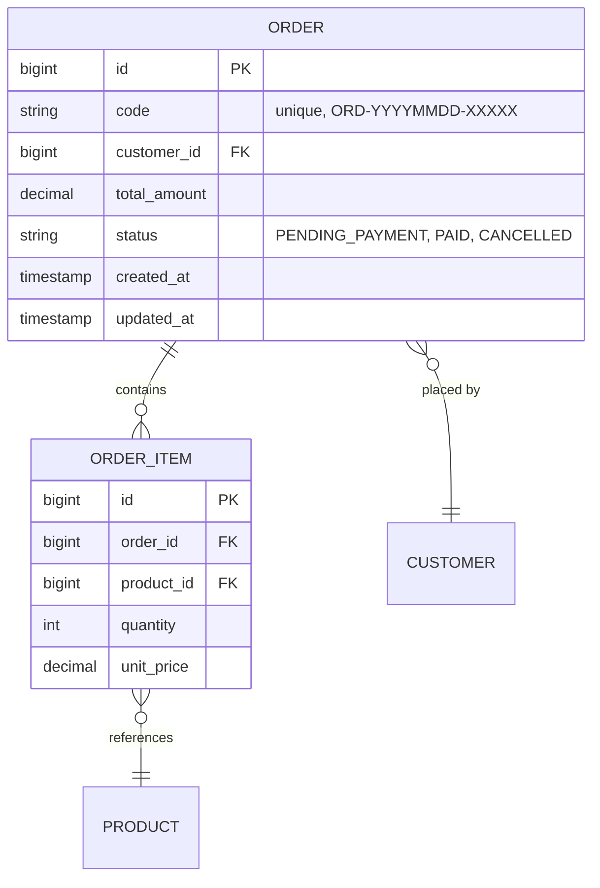

# PTTK: <Tên Feature>

> **PTTK** = Phân tích Thiết kế. File này là **output** của slash command `/rsd-to-pttk` và là **input** cho `/pttk-to-plan`.
>
> Cấu trúc dưới đây khớp 100% với output mà `/rsd-to-pttk` sinh ra. Nếu cần viết tay (không qua command), copy file này và điền vào.

---

## 1. Tổng quan

- **Mục đích**: <1-2 câu mô tả mục tiêu nghiệp vụ>
- **Phạm vi In-scope**:
  - <Tính năng 1>
  - <Tính năng 2>
- **Phạm vi Out-of-scope**:
  - <Không làm 1>
  - <Không làm 2>
- **RSD tham chiếu**: [docs/rsd/<feature>-rsd.md](../rsd/<feature>-rsd.md)
- **Version**: 1.0
- **Ngày tạo**: <YYYY-MM-DD>

## 2. Phân tích nghiệp vụ

### 2.1 Actors

| Actor | Vai trò | Quyền |
|-------|---------|-------|
| <Customer> | <Người tạo đơn> | <CREATE_ORDER, VIEW_OWN_ORDER> |
| <Admin> | <Quản trị viên> | <VIEW_ALL_ORDER, CANCEL_ORDER> |

### 2.2 Use Case chính

**UC-001**: <Tên use case, ví dụ: Tạo đơn hàng mới>

- **Tiền điều kiện**:
  - User đã đăng nhập
  - Giỏ hàng có ít nhất 1 sản phẩm
- **Luồng chính**:
  1. User submit form tạo đơn
  2. System validate dữ liệu
  3. System tạo bản ghi đơn hàng
  4. System trả về mã đơn
- **Luồng phụ / Exception**:
  - Nếu sản phẩm hết hàng → trả lỗi 409 với danh sách sản phẩm thiếu
  - Nếu thanh toán fail → rollback đơn hàng, trả lỗi 402
- **Hậu điều kiện**:
  - Đơn hàng ở trạng thái `PENDING_PAYMENT`
  - Inventory đã được reserve

**UC-002**: <...>

### 2.3 Business Rules

> Mỗi BR phải trace ngược về một hoặc nhiều FR trong RSD.

- **BR-001**: <Mô tả rule, ví dụ "Tổng tiền đơn hàng phải > 0 sau khi áp giảm giá"> — mapping với **FR-001**
- **BR-002**: <Mô tả> — mapping với **FR-003**
- **BR-003**: <...> — mapping với **FR-005**

## 3. Thiết kế kỹ thuật

### 3.1 API Endpoints

| Method | Path | Mô tả | Request | Response | Status codes |
|--------|------|-------|---------|----------|--------------|
| POST | `/api/v1/orders` | Tạo đơn mới | `CreateOrderRequest` | `OrderResponse` | 201 / 400 / 409 |
| GET | `/api/v1/orders/{id}` | Xem chi tiết đơn | - | `OrderResponse` | 200 / 404 |
| PATCH | `/api/v1/orders/{id}/cancel` | Huỷ đơn | `CancelReason` | `OrderResponse` | 200 / 409 |

### 3.2 Data Model



### 3.3 Service Layer

```java
// Chỉ method signatures — KHÔNG implement.
public interface OrderService {
    OrderResponse createOrder(CreateOrderRequest req, Long customerId);
    OrderResponse getOrder(Long orderId, Long requesterId);
    OrderResponse cancelOrder(Long orderId, CancelReason reason, Long requesterId);
}

public interface InventoryReservationService {
    ReservationResult reserve(List<OrderItem> items);
    void release(String reservationId);
}
```

### 3.4 Integration Points

- **Service nội bộ**:
  - `InventoryService.reserveStock()` — gọi khi tạo đơn
  - `PaymentService.charge()` — gọi sau khi đơn ở trạng thái PENDING_PAYMENT
- **External API**:
  - Payment gateway: <tên provider, version, doc link>
- **Message queue / event**:
  - Publish event `OrderCreatedEvent` lên topic `order.created` (Kafka)
  - Subscribe `PaymentCompletedEvent` từ topic `payment.completed`

## 4. Non-functional Requirements

- **Performance**: API `POST /orders` ≤ 500ms p95 với 100 RPS
- **Security**:
  - Auth: JWT bearer token
  - Authorization: chỉ owner hoặc admin được xem đơn
  - PII: số điện thoại / địa chỉ phải mask khi log
- **Logging**:
  - Mọi thay đổi trạng thái đơn → log INFO với orderId, oldStatus, newStatus
  - Lỗi gọi payment gateway → log ERROR + trace ID
- **Monitoring**:
  - Metric: `order.created.count`, `order.creation.latency`
  - Alert khi tỉ lệ lỗi tạo đơn > 1% trong 5 phút

## 5. Tác động và rủi ro

- **Module bị ảnh hưởng**:
  - `inventory-module`: thêm API reserve
  - `notification-module`: subscribe event mới
- **Breaking changes**:
  - <Có / Không. Nếu có, mô tả>
- **Migration DB**:
  - Bảng mới: `orders`, `order_items`
  - Index mới trên `orders.code`, `orders.customer_id`
- **Rollback strategy**:
  - Migration reversible (có script `down`)
  - Feature flag `order.v2.enabled` để bật/tắt

## 6. Test Strategy

- **Unit test scope**:
  - `OrderService` — validate logic, business rules BR-001 đến BR-003
  - Mapper / DTO conversion
- **Integration test scenarios**:
  - Tạo đơn end-to-end với DB thật + payment mock
  - Reserve fail → rollback đơn
- **Edge cases**:
  - Đơn với 1000 sản phẩm
  - Tạo đơn đồng thời cho cùng sản phẩm cuối cùng (race condition)
  - Huỷ đơn đã thanh toán

## 7. Câu hỏi mở (nếu có)

- **Q1**: <Câu hỏi cần PO trả lời trước khi sang bước plan>
